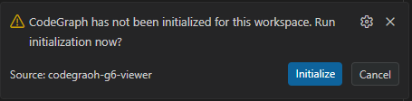
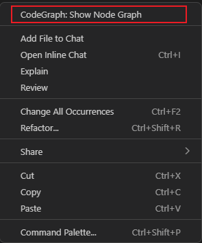
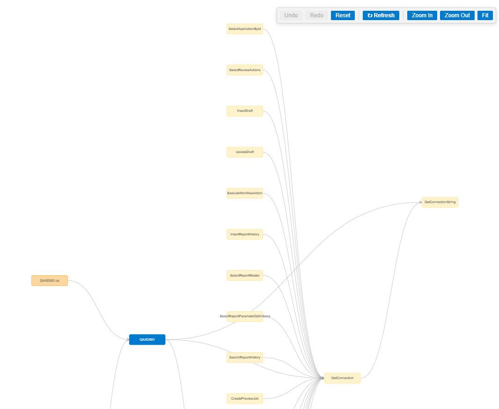
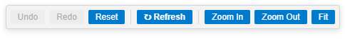

# CodeGraph G6 Viewer

Interactive call-graph visualization for VS Code powered by [CodeGraph](https://www.npmjs.com/package/@colbymchenry/codegraph) and [AntV G6](https://g6.antv.antgroup.com/).

- Browse the full call graph of any file with a single right-click
- Trace a selected symbol's callers and callees
- Expand / collapse nodes on the fly with double-click
- Navigate to source definitions via right-click context menu
- Background incremental sync on file save with stale-data notification
- Undo / redo, zoom controls, adaptive canvas resize

## Requirements

This extension requires a **CodeGraph-indexed workspace**. On first launch it detects whether the project has been initialized and prompts you to run indexing.

 You can also trigger indexing manually:

- **Command Palette** (`Ctrl+Shift+P`) → `CodeGraph: Initialize / Re-index`

Indexing runs in the background via `npx @colbymchenry/codegraph init`. Progress shows elapsed time and a codebase-size-based estimate (e.g. *~3 min for 1500 source files*).

## Usage

1. Open any source file in a CodeGraph-indexed workspace.
2. **Right-click** the editor → `CodeGraph: Show Node Graph`.

   
   - **No selection**: the graph shows all functions, methods, and classes in the current file and their immediate call relationships.
   - **With text selected**: the graph centers on that symbol — showing its callers (incoming) and callees (outgoing).
3. The graph opens in a side panel and fills it adaptively.

### Graph interactions

| Action | Result |
|--------|--------|
| **Double-click** a node | Expand one level — query callers and callees of that node |
| **Double-click** an expanded node | Collapse its subtree |
| **Right-click** a node → `Source` | Jump to the symbol's definition in the editor |
| Drag canvas | Pan the view |
| Scroll | Zoom in / out |
| Drag a node | Reposition it |
| Resize panel / window | Canvas automatically fills the new viewport |

### Toolbar

| Button | Action |
|--------|--------|
| Undo / Redo | Step through expand / collapse history |
| Reset | Return to the initial graph |
| **⚠ Outdated** badge | Appears when the codebase changes behind the scenes |
| **↻ Refresh** | Rebuild the graph from the latest indexed data |
| Zoom In / Zoom Out / Fit | Adjust the viewport |

### Background Sync & Stale Notification

When you save a file in the workspace:

1. The extension debounces saves (2 s) and runs `codegraph sync` silently in the background.
2. If a graph panel is open, a lightweight `dataStale` notification is sent — no heavy data transfer.
3. A **⚠ Outdated** badge appears in the toolbar.
4. Click **↻ Refresh** to rebuild the graph with the latest data. The refresh tries to preserve your current view context (symbol or file), automatically picking up renamed symbols via the cursor position.

## Extension Settings

This extension contributes the following settings (`codegraphG6.*`):

| Setting | Type | Default | Description |
|---------|------|---------|-------------|
| `codegraphG6.maxDepth` | `number` | `2` | Default expansion depth when opening a graph (1–10) |
| `codegraphG6.direction` | `string` | `both` | Traversal direction: `both`, `upstream` (callers only), or `downstream` (callees only) |

## Commands

| Command | ID | Description |
|---------|-----|-------------|
| `CodeGraph: Show Node Graph` | `codegraph-g6.showGraph` | Open the call graph for the current file or selected symbol |
| `CodeGraph: Initialize / Re-index` | `codegraph-g6.manualInit` | Run CodeGraph indexing on the workspace |

## How It Works

1. **CodeGraph** parses the project into a SQLite knowledge graph. It uses Tree-sitter AST extraction rather than a full LSP — making it lightweight, local, and language-agnostic.
2. On `Show Node Graph`, the extension queries CodeGraph for nodes and edges relevant to the current file or selected symbol.
3. The data is rendered as an interactive DAG using **AntV G6** in a VS Code webview panel.
4. Double-clicking a node triggers an incremental backend query; new nodes and edges are added without rebuilding the entire layout.
5. On file save, CodeGraph runs an incremental sync. The webview is notified via a lightweight `dataStale` message — no full graph data is pushed until the user clicks Refresh.

## Supported Languages

All languages supported by CodeGraph are available in this viewer:

TypeScript · JavaScript · Python · Go · Rust · Java · C# · PHP · Ruby · C · C++ · Objective-C · Swift · Kotlin · Scala · Dart · Lua · Luau · R · Svelte · Vue · Astro · Liquid · Pascal/Delphi

*See the [CodeGraph README](https://github.com/colbymchenry/codegraph#supported-languages) for details on file extensions and framework-specific features.*

## License

MIT
